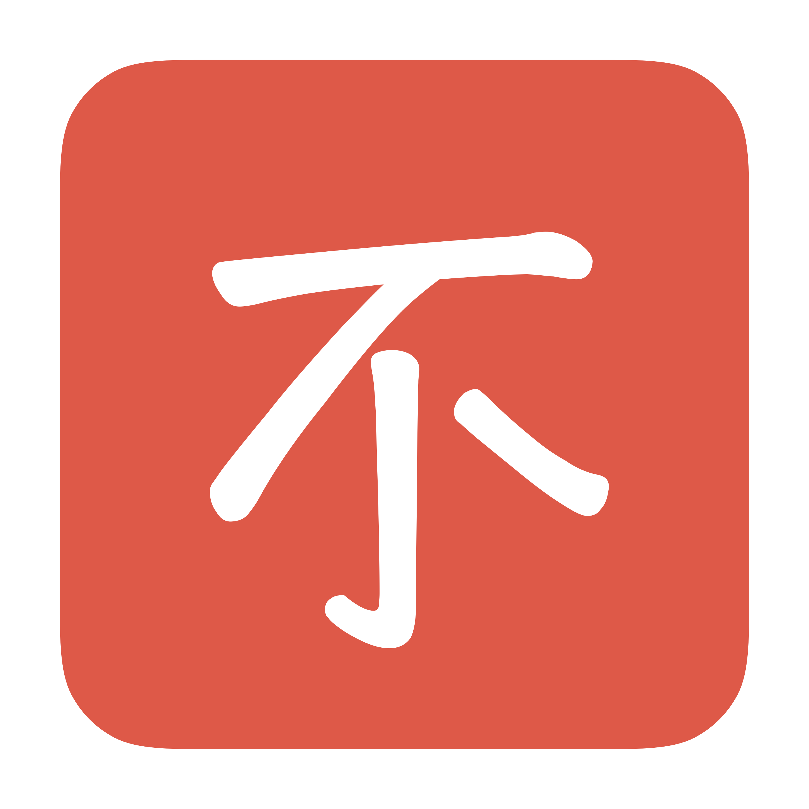
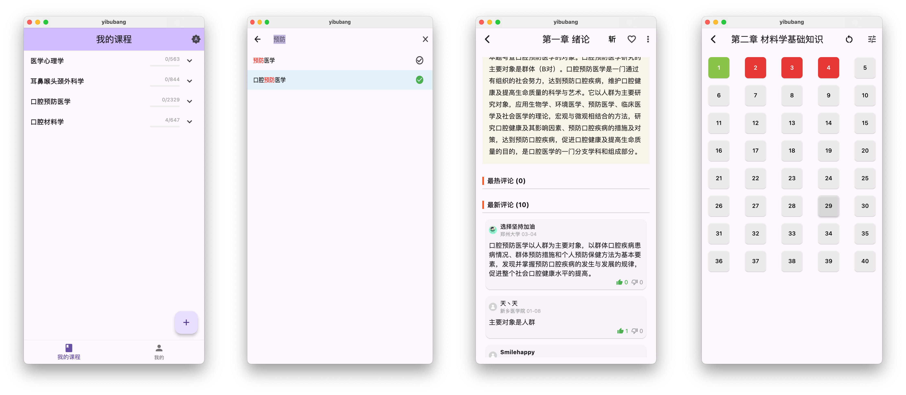

   
  <h3 align="center">医不帮</h3>
  
————为医学生打造的跨平台刷题软件

  

    
    
    
    
    
    
  

  

    <a href="#Features">Features</a> •
    <a href="#Snapshots">Snapshots</a> •
    <a href="#hDownload">Download</a>
  

## Features

### 💻 跨平台

你是否在烦恼电脑上没法刷题？来试试医不帮吧！支持：

- [x] 安卓端（universal、arm64、x86-84）
- [x] MacOS
- [x] Windows
- [x] Linux
- [ ] IOS/iPadOS（即将推出）
- [ ] ~~网页端（目前来说不可行）~~

### ✅ 本地化

没有网就刷不了题了？不存在的！

- 离线数据库
- 本地化存储
- 保护您的作答记录

### ⚡️ 秒启动

- 臃肿的医考帮 ❌
- 轻量的医不帮 ✅ 秒开无广告

### 🚀 支持所有付费题库

> 目前只有**口腔医学期末考试**的全部题库

- 登录后，可以查看题目统计信息和评论区

## TODO

- [x] 调整暗黑模式诸多颜色
- [x] 查看评论区回复
- [ ] 做题日历 + 做题数量统计
- [ ] 只重做错的题
- [ ] 登录医考帮后，同步做题记录
- [ ] 选择题库功能
- [ ] 题库更新（临床、护理题库）

## Snapshots

## Download

- Github: https://github.com/nanguaguag/yibubang/releases
- Gitee: https://gitee.com/pumpkin_melon/yibubang/releases
