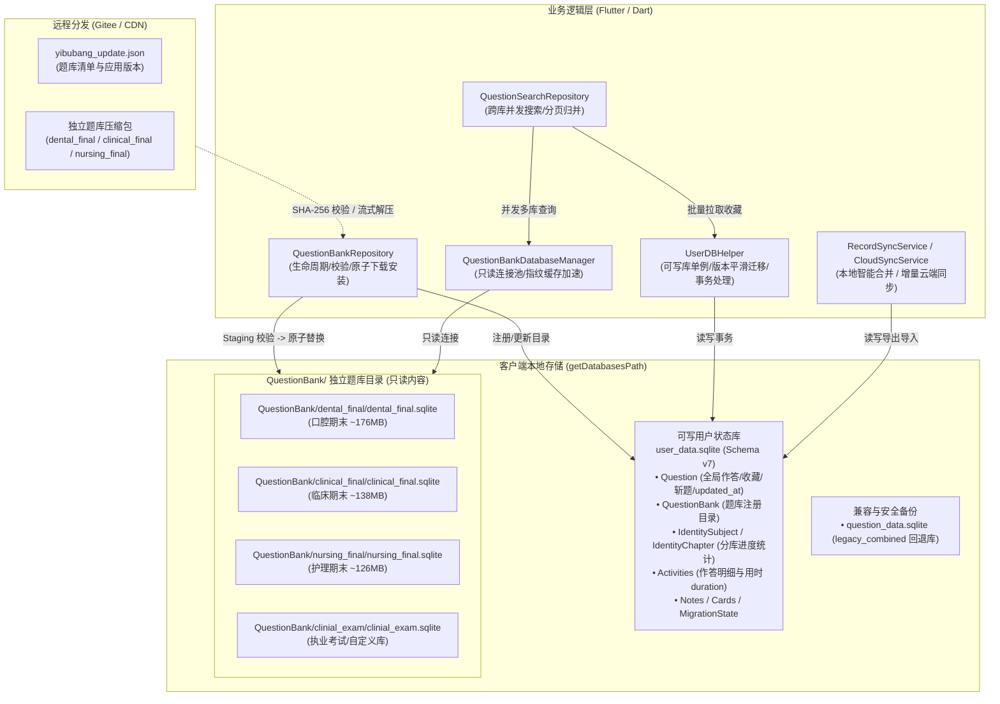
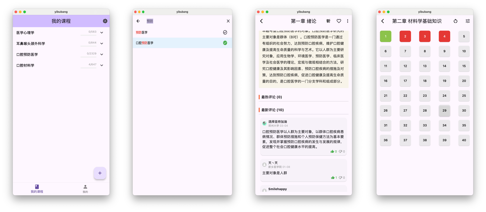
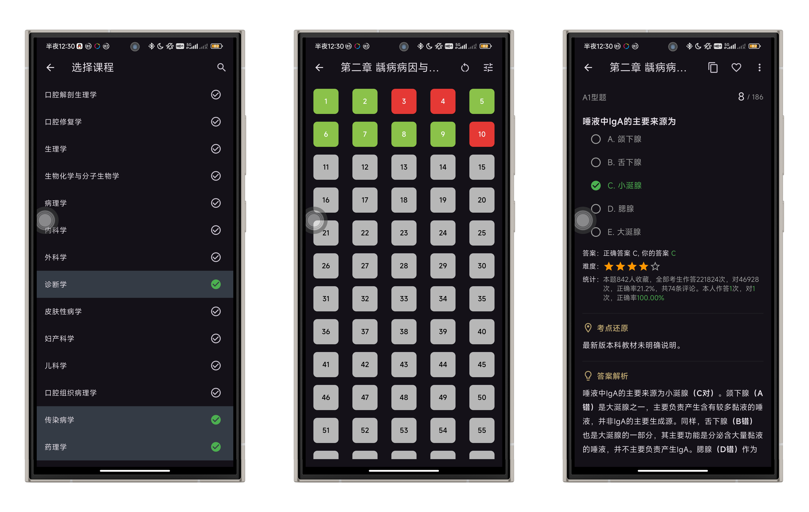
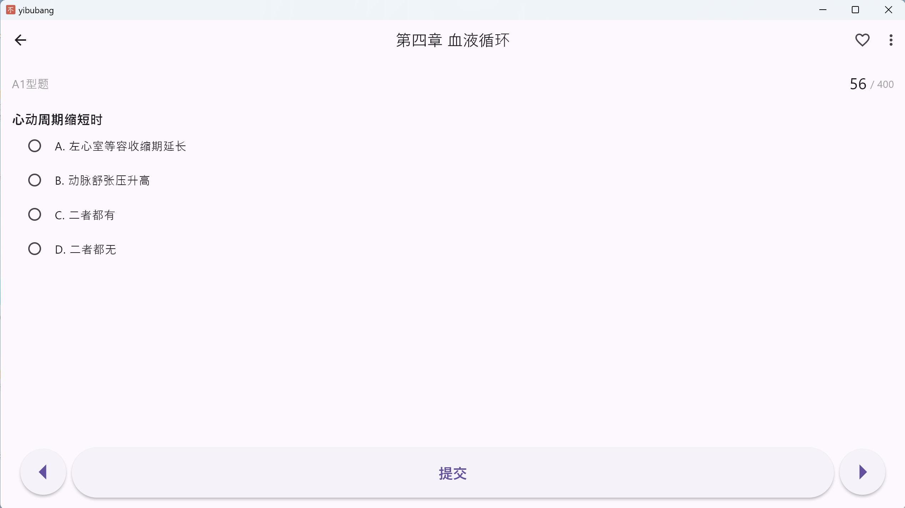
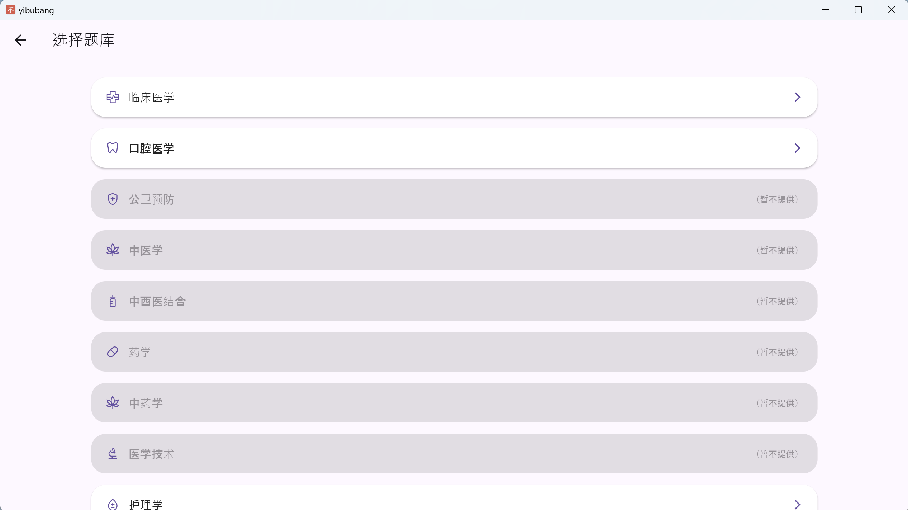

<p align="center">
  <br>
  <h1 align="center">医不帮 (Yibubang)</h1>
  <p align="center"><strong>专为医学生打造的现代化、离线优先、跨平台刷题与复习利器</strong></p>
  <p align="center">A Modern, Offline-First, Cross-Platform Medical Exam Preparation App for Medical Students.</p>
  <div align="center">
    <a href="https://github.com/nanguaguag/yibubang"></a>
    <a href="https://github.com/nanguaguag/yibubang/blob/main/LICENSE"></a>
    <a href="https://github.com/nanguaguag/yibubang/actions/workflows/android.yml"></a>
    <a href="https://github.com/nanguaguag/yibubang/actions/workflows/macos.yml"></a>
    <a href="https://github.com/nanguaguag/yibubang/actions/workflows/windows.yml"></a>
    <a href="https://github.com/nanguaguag/yibubang/actions/workflows/linux.yml"></a>
    <a href="https://t.me/yibubang"></a>
  </div>
  <br>
  <div align="center">
    <strong><a href="#-简体中文">🇨🇳 简体中文</a></strong> •
    <strong><a href="#-english">🇺🇸 English</a></strong> •
    <strong><a href="README_EN.md">📄 Dedicated English Doc</a></strong>
  </div>
</p>

---

## 目录 / Table of Contents

- [🇨🇳 简体中文](#-简体中文)
  - [项目简介](#-项目简介)
  - [核心特性](#-核心特性)
  - [数据库与技术架构](#-数据库与技术架构)
  - [内置与支持题库](#-内置与支持题库)
  - [平台支持与下载](#-平台支持与下载)
  - [快速上手与构建](#-快速上手与构建)
  - [功能进展 (Roadmap)](#-功能进展-roadmap)
  - [界面预览](#-界面预览)
- [🇺🇸 English](#-english)
  - [Introduction](#-introduction)
  - [Key Features](#-key-features)
  - [Architecture & Database Design](#-architecture--database-design)
  - [Supported Question Banks](#-supported-question-banks)
  - [Platform Support & Download](#-platform-support--download)
  - [Getting Started & Build Guide](#-getting-started--build-guide)
  - [Roadmap](#-roadmap)
  - [Snapshots](#-snapshots)
- [社区交流与开源许可 / Community & License](#-社区交流与开源许可--community--license)

---

## 🇨🇳 简体中文

### 💡 项目简介

**医不帮 (yibubang)** 是一款面向医学生的开源跨平台专业刷题工具。传统刷题软件常受制于强制联网、臃肿广告、缺乏桌面端适配以及题库绑定等痛点。医不帮采用 **Flutter** 驱动与 **离线优先 (Offline-First)** 理念，在手机、平板与电脑（Android、Windows、macOS、Linux、iOS）上提供一致流畅的高性能刷题体验。

项目采用彻底解耦的 **“多题库物理拆分 + 全局共享用户状态”** 架构，题库与作答数据物理隔离，在保障数十万道专业医学题目随开随刷的同时，让用户的答题记录、错题、收藏和刷题流水永远安全留存于本地。

---

### ✨ 核心特性

- 💻 **全平台桌面与移动端无缝协同**
  - 原生适配 Android、Windows、macOS、Linux，iOS/iPadOS 适配中。
  - 支持快捷键翻页、响应式桌面大屏排版与移动端单手操作优化。
- ⚡️ **秒级极速冷启动，纯净无广告**
  - 零启动广告、零强制收集隐私、零捆绑推广，毫秒级进入刷题界面。
  - 基于文件指纹缓存校验技术，百兆级 SQLite 数据库冷启动耗时低于 5 毫秒。
- 🎯 **多样化刷题与复习模式**
  - **练习模式**：即时判断正误，查看详尽解析、真题年份归属、知识点标签与高分辨率配图。
  - **快刷模式**：专注高效刷题，自动流转，提升过题密度。
  - **测试模式**：模拟考场环境，隐藏答案即时反馈，底部考卷状态栏快速交卷，生成全维度测验报告。
  - **背题模式**：直接显示参考答案与精解，考前冲刺突击记忆神器。
  - **多维过滤**：支持按题型（单选/多选）、斩题状态（全部/已斩/未斩）、作答类别（全部/错题/收藏/未做）灵活自由筛选。
- 📊 **学习统计看板与可视化热力图**
  - 毫秒级答题用时追踪（`duration`），精准记录每道题的思考时长。
  - GitHub 风格的 **“刷题格子墙 / 活跃热力图”**，直观呈现每日答题量与复习专注时长。
  - 课程与章节双层进度统计、正误率图表与历史活动明细回溯。
- 🔍 **全库高并发全文检索**
  - 支持跨所有已启用题库并发模糊检索，覆盖题干、选项、解析与考点还原。
  - 分页流畅呈现，一键直达原题，跨库批量同步收藏与斩题状态。
- 🔄 **完备的数据备份与全端同步**
  - **本地归档导出/导入**：将作答进度一键打包为 `.zip` 文件，导入支持“全量覆盖”与“智能合并”（本地优先、收藏斩题取并集、流水去重追加）。
  - **自建云同步**：通过轻量配对码机制，基于毫秒级时间戳（`updated_at`）与 LWW（Last-Write-Wins）算法实现增量安全互相同步。
  - **医考帮在线交互**：支持登录查看题目官方评论区及精选回复；离线队列（斩题/作答/重做章节）待联网后自动上报同步。

---

### 🗄 数据库与技术架构

项目基于 SQLite 构建了兼具高性能、高扩展与强容灾的存储架构，遵循 **“内容只读与用户可写物理分离”** 的核心原则：


```mermaid
flowchart TD
    subgraph Remote["远程分发 (Gitee / CDN)"]
        UpdateJSON["yibubang_update.json\n(题库清单与应用版本)"]
        BankZIPs["独立题库压缩包\n(dental_final / clinical_final / nursing_final)"]
    end

    subgraph Storage["客户端本地存储 (getDatabasesPath)"]
        UserData["可写用户状态库\nuser_data.sqlite (Schema v7)\n• Question (全局作答/收藏/斩题/updated_at)\n• QuestionBank (题库注册目录)\n• IdentitySubject / IdentityChapter (分库进度统计)\n• Activities (作答明细与用时 duration)\n• Notes / Cards / MigrationState"]
        
        subgraph QuestionBanksDir["QuestionBank/ 独立题库目录 (只读内容)"]
            BankDental["QuestionBank/dental_final/dental_final.sqlite\n(口腔期末 ~176MB)"]
            BankClinical["QuestionBank/clinical_final/clinical_final.sqlite\n(临床期末 ~138MB)"]
            BankNursing["QuestionBank/nursing_final/nursing_final.sqlite\n(护理期末 ~126MB)"]
            BankCustom["QuestionBank/clinial_exam/clinial_exam.sqlite\n(执业考试/自定义库)"]
        end

        LegacyBackup["兼容与安全备份\n• question_data.sqlite (legacy_combined 回退库)"]
    end

    subgraph Memory["业务逻辑层 (Flutter / Dart)"]
        Repo["QuestionBankRepository\n(生命周期/校验/原子下载安装)"]
        Mgr["QuestionBankDatabaseManager\n(只读连接池/指纹缓存加速)"]
        UserHelper["UserDBHelper\n(可写库单例/版本平滑迁移/事务处理)"]
        SearchRepo["QuestionSearchRepository\n(跨库并发搜索/分页归并)"]
        SyncService["RecordSyncService / CloudSyncService\n(本地智能合并 / 增量云端同步)"]
    end

    Remote -.->|SHA-256 校验 / 流式解压| Repo
    Repo -->|Staging 校验 -> 原子替换| QuestionBanksDir
    Repo -->|注册/更新目录| UserData
    Mgr -->|只读连接| QuestionBanksDir
    UserHelper -->|读写事务| UserData
    SearchRepo -->|并发多库查询| Mgr
    SearchRepo -->|批量拉取收藏| UserHelper
    SyncService -->|读写导出导入| UserData
```

#### 架构技术亮点
1. **全局 Question ID 契约**：题目 ID 全局唯一。同道题目出现在多个题库（例如临床期末与执业医师）时，答题状态、斩题和收藏自动互通，无需重复做题。
2. **原子更新与自动回滚机制**：题库更新采用 `.staging` 暂存下载解压，通过 5 重安全校验后原子替换正式文件，更新前自动生成 `.bak` 备份，失败时秒级回滚。
3. **文件指纹校验缓存**：将 `size:modifiedTime` 指纹持久化于本地，二次启动直接跳过百兆 SQLite 的 `PRAGMA integrity_check` 全库扫描，启动速度提升数百倍。
4. **历史库平滑降级（Fail-safe）**：对老用户保留旧版单体 `question_data.sqlite` 作为 `legacy_combined` 回退源，即便新题库损坏亦可无感平滑刷题。
5. **ATTACH 跨库重算**：提供纯 SQL 高性能统计校准，通过 `ATTACH DATABASE` 在毫秒级完成数十万题目的跨库归并与进度自愈。

> 详细数据库设计文档请参阅：[docs/antigravity/database_current.md](docs/antigravity/database_current.md)。

---

### 📚 内置与支持题库

系统支持多套官方专业题库独立下载、更新与管理，并允许用户无缝导入自定义扩展题库：

| 题库标识 (`bank_id`) | 题库官方名称 | 题目规模 | 课程数 | 章节数 | 题库包体大小 (ZIP / 解压后) | 状态 |
| :--- | :--- | :---: | :---: | :---: | :---: | :---: |
| `dental_final` | **口腔期末题库** | 78,310 | 45 | 1,132 | ~32.5 MB / ~176 MB | 官方已发布 |
| `clinical_final` | **临床期末题库** | 57,346 | 40 | 1,137 | ~25.9 MB / ~138 MB | 官方已发布 |
| `nursing_final` | **护理期末题库** | 69,591 | 50 | 928 | ~24.1 MB / ~126 MB | 官方已发布 |
| `clinial_exam` | **临床执业医师考试** | 18,806 | 22 | 540 | ~12.0 MB / ~57 MB | 扩展支持 |
| *自定义题库* | 用户本地导入 (`.sqlite` / `.zip`) | 自适应 | 自适应 | 自适应 | 不限 | 开放支持 |

---

### 📥 平台支持与下载

| 操作系统 | 支持架构 / 安装包格式 | 当前支持状态 |
| :--- | :--- | :---: |
| **Android** | `arm64-v8a`, `armeabi-v7a`, `x86_64`, `Universal APK` | ✅ 稳定支持 |
| **Windows** | `x64` 免安装压缩包 / 便携版 | ✅ 稳定支持 |
| **macOS** | `Apple Silicon (arm64)`, `Intel (x86_64)` DMG / App | ✅ 稳定支持 |
| **Linux** | `x86_64` (Tar.gz / AppImage) | ✅ 稳定支持 |
| **iOS / iPadOS** | 移动端适配与签名调试 | 🚧 积极适配中 |

- 📦 **GitHub Releases**：[https://github.com/nanguaguag/yibubang/releases](https://github.com/nanguaguag/yibubang/releases)
- 🚀 **Gitee 国内镜像分发**：[https://gitee.com/pumpkin_melon/yibubang/releases](https://gitee.com/pumpkin_melon/yibubang/releases)

---

### 🛠 快速上手与构建

#### 环境要求
- [Flutter SDK](https://flutter.dev/) `>= 3.27.3`
- [Dart SDK](https://dart.dev/) `>= 3.6.1`
- 对应目标平台编译环境（Android Studio / Xcode / Visual Studio C++ 工具集 / Linux build-essential）

#### 本地运行与打包
```bash
# 1. 克隆代码仓库
git clone https://github.com/nanguaguag/yibubang.git
cd yibubang

# 2. 安装项目依赖
flutter pub get

# 3. 本地调试运行 (根据连接的设备或桌面环境)
flutter run

# 4. 构建指定平台发行包
# Android APK
flutter build apk --split-per-abi

# Windows 桌面端
flutter build windows

# macOS 桌面端
flutter build macos

# Linux 桌面端
flutter build linux
```

---

### 🗺 功能进展 (Roadmap)

- [x] 多题库物理拆分与独立动态下载/更新（口腔、临床、护理、执业医师）
- [x] 全题库高并发模糊搜索与收藏状态快速拉取
- [x] 刷题时长毫秒级记录与 GitHub 风格做题格子墙（打卡热力图）
- [x] 四种刷题模式（练习、快刷、测试、背题）与多维度筛选（斩题/错题/收藏）
- [x] 考前背题与测试模拟交卷评分机制
- [x] 本地做题记录 ZIP 导出与智能双向合并（Merge）
- [x] 基于配对码机制的自建云端增量数据同步（LWW 冲突解决）
- [x] 医考帮离线同步队列（斩题/答题/重做章节联网后自动上报）
- [x] 查看题目在线评论区与精选社区讨论
- [x] 自定义第三方题库导入与元数据自动化校验
- [x] 字体缩放（0.85x ~ 1.3x）与深色/浅色主题无缝切换
- [ ] iOS / iPadOS 正式包打包与签名指南
- [ ] Web 端轻量化查询与学习报告只读查看器

---

### 📸 界面预览

<p align="center">
  
  
</p>
<p align="center">
  
  
</p>
